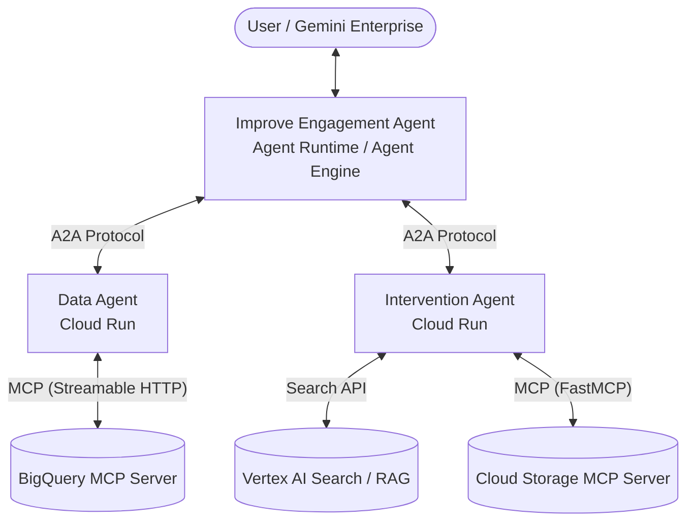

# Lab Instructions: Building a Multi-Agent System with ADK, A2A, MCP, and Agent Runtime

---

## Overview

In this hands-on lab, you build and deploy a multi-agent system on Google Cloud for **Cymbal Meet** (a fictional videoconferencing company). The system identifies underperforming customers and automatically generates tailored remediation/intervention materials.



### Key Components

| Component | Role | Technology / Protocol |
| :--- | :--- | :--- |
| **Data Agent** | BigQuery domain expert; translates NL to SQL and queries metrics. | ADK, BigQuery MCP, Model Armor, OpenTelemetry, Cloud Run |
| **Improve Engagement Agent** | User-facing coordinator; orchestrates sub-agents and presents findings. | ADK, A2A Client, Agent Runtime / Agent Engine, Gemini Enterprise |
| **Intervention Agent** | Generates branded PDF intervention docs using RAG & uploads to GCS. | ADK, Vertex AI Search, WeasyPrint, GCS MCP, Cloud Run |

---

## Task 1. Implement and Deploy the Data Agent

### 1.2 Review the Data Agent Code

Before making any changes, familiarize yourself with the agent's structure, system prompt, and the `TODO` placeholders.

1. In the Cloud Shell Editor file explorer, navigate to `agents/data_agent` and open `agent.py`.
2. Read through the `DATA_AGENT_INSTRUCTION` prompt:
   - Note how it instructs the agent to discover BigQuery table schemas dynamically using MCP tools rather than hardcoding column names.
   - Note how it defines rules for identifying underperforming customers relative to their segment averages.
3. Locate the `Gemini3` class:
   - This class extends the ADK Gemini model class to override the API client configuration.
   - It sets `location='global'`, which is required for Gemini 3 models that are served from the global endpoint rather than a regional one.
4. Scan through the file from top to bottom and locate the `TODO` comments:
   - `TODO MODELARMOR IMPORT` – Import the Model Armor safety filter plugin.
   - `TODO MCP TOOLSET` – Create the MCP toolset with Streamable HTTP connection and service account authentication.
   - `TODO MCP TOOL` – Wire the toolset into the agent's tools list.
   - `TODO MODELARMOR RUNNER` – Create an `InMemoryRunner` with the Model Armor safety filter plugin.
   - `TODO A2A APP` – Expose the agent as an A2A server using `to_a2a`.

---

### 1.3 Implement MCP Client Functionality

Connect the data agent to BigQuery by configuring the MCP endpoint, authentication, and toolset.

> [!NOTE]
> **Useful References:**
> - [BigQuery MCP Documentation](https://cloud.google.com/bigquery/docs/mcp)
> - [ADK MCPToolset Class](https://github.com/google-gemini/agent-development-kit)
> - [ADK Auth Schemes & Credentials](https://github.com/google-gemini/agent-development-kit)

> [!IMPORTANT]
> When pasting code into the editor, ensure Python indentation is correct.

1. Find the `# --- BigQuery MCP toolset ---` comment in `agents/data_agent/agent.py`. Note the endpoint (`BIGQUERY_MCP_ENDPOINT`) and the scopes (`BIGQUERY_SCOPES`).
2. Replace the `pass` statement inside the `_create_bigquery_mcp_toolset()` function with the following:

```python
    return McpToolset(
        connection_params=StreamableHTTPConnectionParams(
            url=BIGQUERY_MCP_ENDPOINT,
        ),
        auth_scheme=OAuth2(
            flows=OAuthFlows(
                clientCredentials=OAuthFlowClientCredentials(
                    tokenUrl="https://oauth2.googleapis.com/token",
                    scopes={s: "" for s in BIGQUERY_SCOPES},
                ),
            ),
        ),
        auth_credential=AuthCredential(
            auth_type=AuthCredentialTypes.SERVICE_ACCOUNT,
            service_account=ServiceAccount(
                use_default_credential=True,
                scopes=BIGQUERY_SCOPES,
            ),
        ),
    )
```

3. In the `root_agent` definition, replace the `TODO MCP TOOL` placeholder inside the `tools` list with:

```python
        _create_bigquery_mcp_toolset(),
```

> [!NOTE]
> **Summary:** The data agent is now connected to BigQuery via MCP. It can discover schemas (`list_table_ids`, `get_table_info`) and execute queries (`execute_sql`) authenticating automatically via Application Default Credentials (ADC).

---

### 1.4 Note OpenTelemetry Functionality

1. In `agent.py`, locate the `# --- Telemetry configuration...` comment block and read the telemetry configuration.
2. Note how it configures OpenTelemetry exporters and resources to stream traces and logs to Google Cloud Observability (Cloud Logging and Cloud Trace).

> [!NOTE]
> **Summary:** This telemetry configuration enables the agent to export both traces and logs to Google Cloud. Once deployed, you can inspect agent invocations, tool calls, and LLM interactions in Cloud Trace and Cloud Logging.

---

### 1.5 Implement Model Armor Safety Guardrails

Integrate Model Armor to screen model responses for sensitive data, harmful content, or malicious URLs.

> [!NOTE]
> **Useful References:**
> - [ADK Plugins & Callbacks](https://github.com/google-gemini/agent-development-kit)
> - [Model Armor Overview](https://cloud.google.com/security/model-armor)
> - [Sensitive Data Protection (SDP)](https://cloud.google.com/sensitive-data-protection)

1. Open `agents/data_agent/model_armor_plugin.py` and observe:
   - `ModelArmorSafetyFilterPlugin` extends `BasePlugin` and implements `after_model_callback`.
   - It connects to a configured Model Armor template to filter RAI content, CSAM, malicious URLs, and mask sensitive data (SDP).
2. Switch back to `agents/data_agent/agent.py`. Notice the import:
   ```python
   from model_armor_plugin import ModelArmorSafetyFilterPlugin
   ```
3. Locate the `TODO MODELARMOR RUNNER` comment and paste the following directly below it:

```python
runner = InMemoryRunner(
    agent=root_agent,
    app_name="data_agent",
    plugins=[ModelArmorSafetyFilterPlugin()],
)
```

> [!NOTE]
> **Summary:** All LLM responses will now route through `after_model_callback` for safety screening and sensitive data redaction before being returned.

---

### 1.6 Implement A2A Server Functionality

Expose the data agent as an Agent-to-Agent (A2A) server so orchestrators can invoke it over standard JSON-RPC.

> [!NOTE]
> **Useful References:**
> - [A2A Introduction — When to Use A2A](https://a2aproject.github.io)
> - [A2A Quickstart — Exposing a Remote Agent](https://a2aproject.github.io)

1. Open `agents/data_agent/agent_card.json.template` and inspect:
   - `name` and `description`: Identifies the agent as the Cymbal Meet data domain expert.
   - `skills`: Lists high-level analysis and BigQuery MCP tool capabilities.
   - `preferredTransport`: Set to `JSONRPC` with `protocolVersion` `0.3.0`.
   - `url`: `http://localhost:8080` (overridden upon deployment).
2. Switch back to `agents/data_agent/agent.py`. Locate the `TODO A2A APP` comment and paste:

```python
a2a_app = to_a2a(
    root_agent,
    agent_card="agent_card.json",
    runner=runner,
)
```

> [!NOTE]
> **Summary:** `to_a2a()` wraps the root agent and runner into an A2A-compliant server exposing the agent card metadata and endpoints.

---

### 1.7 Launch the Agent Locally

1. In the Cloud Shell terminal, change directory to the data agent folder:
   ```bash
   cd ~/specialized-training-content/courses/atf_cloud_interactive/agents/data_agent
   ```

2. Create a service account key file for `cymbal-agent`:
   ```bash
   gcloud iam service-accounts keys create sa_key.json \
     --iam-account=cymbal-agent@qwiklabs-gcp-01-55842f6072fd.iam.gserviceaccount.com
   ```

3. Configure Application Default Credentials (ADC):
   ```bash
   export GOOGLE_APPLICATION_CREDENTIALS=$(pwd)/sa_key.json
   ```

4. Create and activate a Python virtual environment, then install dependencies:
   ```bash
   uv venv .venv
   source .venv/bin/activate
   uv pip install -r requirements.txt
   ```

5. Copy the `.env.example` template:
   ```bash
   cp .env.example .env
   ```

   | Variable | Purpose |
   | :--- | :--- |
   | `GOOGLE_CLOUD_PROJECT` | Your Google Cloud project ID. |
   | `GOOGLE_CLOUD_LOCATION` | Region for Gemini Enterprise Agent Platform (`us-central1`). |
   | `GOOGLE_GENAI_USE_VERTEXAI` | Directs GenAI SDK requests to Vertex AI / Agent Platform. |
   | `OTEL_INSTRUMENTATION_GENAI_CAPTURE_MESSAGE_CONTENT` | Captures message contents in OpenTelemetry traces. |
   | `MODEL_ARMOR_LOCATION` | Region for Model Armor API endpoint. |
   | `MODEL_ARMOR_TEMPLATE` | Resource path to the Model Armor template. |

6. Substitute your project ID in `.env`:
   ```bash
   sed -i "s/<YOUR_PROJECT_ID>/qwiklabs-gcp-01-55842f6072fd/g" .env
   ```

7. Copy the agent card template:
   ```bash
   cp agent_card.json.template agent_card.json
   ```

8. Start the local A2A server:
   ```bash
   uvicorn agent:a2a_app --host 0.0.0.0 --port 8080
   ```

---

### 1.8 Test the Local Server with A2A Inspector

1. Open a **new terminal tab** in Cloud Shell (`+` icon).
2. Clone the A2A Inspector repository and install its dependencies:
   ```bash
   cd ~
   git clone https://github.com/a2aproject/a2a-inspector.git
   cd a2a-inspector
   uv sync
   cd frontend && npm install && cd ..
   ```

3. Launch the inspector:
   ```bash
   bash scripts/run.sh
   ```

4. In Cloud Shell, click **Web preview > Change port** (upper right), set port to `5001`, and click **Change and Preview**.
5. In the A2A Inspector interface, set **Agent URL** to `http://localhost:8080` and click **Connect**.

   > [!NOTE]
   > **Why localhost?** Both the A2A Inspector and the data agent run inside the same Cloud Shell VM. Localhost avoids proxy/authentication cookie issues.

6. In the Chat area, test with sample queries:
   - `What tables are available in the cymbal_meet dataset?`
   - Click **New session** and test: `List the last 10 logins`
   - Notice that email addresses in the output are redacted by **Model Armor**.

7. **Inspect Observability Data in Cloud Console:**
   - Go to **Logging > Logs Explorer**, query `logins`, and inspect the log entries with `finish_reason: STOP`.
   - Go to **Trace > Trace Explorer**, click on a `generate_content` span to view inputs, outputs, tokens, and latencies.

8. **Clean up Local Test Processes:**
   - In terminal tab 2: Press `Ctrl+C` to stop A2A Inspector.
   - In terminal tab 1: Press `Ctrl+C` to stop Uvicorn, then run:
     ```bash
     deactivate
     ```

---

### 1.9 Deploy and Test on Cloud Run

1. In terminal tab 1, update `agent_card.json` with the Cloud Run service URL:
   ```bash
   PROJECT_NUMBER=$(gcloud projects describe qwiklabs-gcp-01-55842f6072fd --format="value(projectNumber)")
   sed -i "s|http://localhost:8080|https://data-agent-${PROJECT_NUMBER}.us-central1.run.app|" agent_card.json
   ```

2. Export required deployment environment variables:
   ```bash
   export GOOGLE_CLOUD_PROJECT="qwiklabs-gcp-01-55842f6072fd"
   export GOOGLE_CLOUD_LOCATION="us-central1"
   export MODEL_ARMOR_LOCATION="us"
   export AGENT_SA="cymbal-agent@qwiklabs-gcp-01-55842f6072fd.iam.gserviceaccount.com"
   export AGENT_SERVICE_NAME="data-agent"
   ```

3. Review and execute the deployment script:
   ```bash
   . ./deploy_to_run.sh
   ```

   | Setting | Detail |
   | :--- | :--- |
   | **Service Account** | Dedicated agent identity (`cymbal-agent@...`) |
   | **Minimum Instances** | Set to `1` to eliminate cold starts |
   | **Environment Variables** | Includes Vertex AI, Model Armor, and OpenTelemetry configs |

4. Generate an identity token for authentication:
   ```bash
   gcloud auth print-identity-token
   ```

5. In terminal tab 2, restart A2A Inspector:
   ```bash
   bash scripts/run.sh
   ```

6. In terminal tab 3 (`+` icon), start a Cloudflare tunnel:
   ```bash
   wget -q https://github.com/cloudflare/cloudflared/releases/latest/download/cloudflared-linux-amd64 -O cloudflared
   chmod +x cloudflared
   ./cloudflared tunnel --url http://localhost:5001
   ```
   Copy the generated public URL (`https://<random-words>.trycloudflare.com`) and open it in your browser.

7. In A2A Inspector:
   - **Agent URL**: `https://data-agent-550428820556.us-central1.run.app`
   - **Auth Type**: `Bearer Token`
   - **Token**: *(Paste identity token from step 4)*
   - Click **Connect** and test: `How many customers are in each segment?`

8. Clean up and terminate terminal processes (`Ctrl+C`), then close extra tabs.

---

## Task 2. Implement the Improve Engagement Agent

> [!TIP]
> **Catch-up Option (Optional):**
> If you missed Task 1, run the following in Cloud Shell:
> ```bash
> cd ~/specialized-training-content/courses/atf_cloud_interactive/agents/data_agent
> bash catchup_data_agent.sh
> ```

### 2.1 Review the Improve Engagement Agent Template

1. Set your default project in Cloud Shell:
   ```bash
   gcloud config set project qwiklabs-gcp-01-55842f6072fd
   ```

2. Open the workspace and navigate to the agent directory:
   ```bash
   cd ~/specialized-training-content/courses/atf_cloud_interactive
   cloudshell workspace .
   cd agents/improve_engagement_agent
   ```

3. Open and review `prompt_task3.py` and `agent.py`.
   - **No MCP client**: Does not connect to MCP servers directly; delegates data queries via A2A.
   - **A2A Client**: Acts as a client calling remote agents, deployed directly to Agent Runtime.

---

### 2.2 Implement Cloud Run OIDC Authentication

Add an HTTP authentication helper that attaches Google OIDC identity tokens to outbound requests targeting Cloud Run.

In `agents/improve_engagement_agent/agent.py`, locate `TODO CLOUD_RUN_AUTH` and add:

```python
class _CloudRunAuth(httpx.Auth):
    """httpx Auth that attaches OIDC identity tokens for Cloud Run."""

    def __init__(self, audience: str):
        self._audience = audience

    def auth_flow(self, request):
        if request.url.host in ("localhost", "127.0.0.1"):
            yield request
            return

        auth_request = google.auth.transport.requests.Request()
        token = google.oauth2.id_token.fetch_id_token(
            auth_request, audience=self._audience
        )
        request.headers["Authorization"] = f"Bearer {token}"
        yield request
```

---

### 2.3 Create a RemoteA2aAgent for the Data Agent

In `agent.py`, locate `TODO DATA_AGENT_CLIENT` and add:

```python
_data_agent_http = httpx.AsyncClient(
    auth=_CloudRunAuth(DATA_AGENT_URL),
    timeout=httpx.Timeout(timeout=600.0),
)

data_agent = RemoteA2aAgent(
    name="data_agent",
    description=(
        "Cymbal Meet data domain expert. Accepts natural language questions "
        "and translates them to SQL, executes via BigQuery, "
        "and returns structured results. Delegate ALL data-related questions "
        "to this agent—never attempt to query data directly."
    ),
    agent_card=f"{DATA_AGENT_URL}/.well-known/agent.json",
    httpx_client=_data_agent_http,
)
```

---

### 2.4 Create an AgentTool for the Data Agent

In `agent.py`, locate `TODO AGENT_TOOLS...` and add:

```python
data_tool = AgentTool(agent=data_agent)
```

---

### 2.5 Register the Tool on the Root Agent

In `agent.py`, find the `root_agent` definition and update the `tools` list (`TODO REGISTER_TOOLS`):

```python
tools=[
    data_tool,
],
```

---

### 2.6 Test the Agent Locally with ADK Web UI

1. Create `.env`:
   ```bash
   cp .env.example .env
   ```
   Ensure `.env` contains:
   ```env
   GOOGLE_CLOUD_PROJECT="qwiklabs-gcp-01-55842f6072fd"
   GOOGLE_CLOUD_LOCATION=us-central1
   GOOGLE_GENAI_USE_VERTEXAI=True
   OTEL_INSTRUMENTATION_GENAI_CAPTURE_MESSAGE_CONTENT=True
   DATA_AGENT_URL=https://data-agent-550428820556.us-central1.run.app
   INTERVENTION_AGENT_URL=https://intervention-agent-550428820556.us-central1.run.app
   ```

2. Change to the parent `agents` directory, set up the virtual environment, and patch ADK scopes:
   ```bash
   cd ~/specialized-training-content/courses/atf_cloud_interactive/agents
   uv venv
   source .venv/bin/activate
   uv pip install -r requirements.txt
   . ./patch_adk_scopes.sh
   ```

3. Launch ADK Web:
   ```bash
   adk web --otel_to_cloud
   ```

4. Open the ADK Web client in your browser, select **Improve Engagement Agent**, and test:
   - `Find customers with low login rates`
   - `Are there any mid market customers with poor device performance?`

5. Verify cross-agent traces and logs in Cloud Logging and Cloud Trace.
6. Press `Ctrl+C` in the terminal to stop the ADK server.

---

### 2.7 Deploy the Agent to Agent Runtime

1. Unset ADC in Cloud Shell:
   ```bash
   unset GOOGLE_APPLICATION_CREDENTIALS
   ```

2. Prepare `.env.deploy` (used by Agent Runtime):
   ```bash
   cd improve_engagement_agent
   cp .env.deploy.example .env.deploy
   ```

   Verify `.env.deploy` contains:
   ```env
   GOOGLE_GENAI_USE_VERTEXAI=True
   GOOGLE_CLOUD_AGENT_ENGINE_ENABLE_TELEMETRY=True
   OTEL_INSTRUMENTATION_GENAI_CAPTURE_MESSAGE_CONTENT=True
   STAGING_BUCKET=gs://qwiklabs-gcp-01-55842f6072fd-agent-staging
   DATA_AGENT_URL=https://data-agent-550428820556.us-central1.run.app
   INTERVENTION_AGENT_URL=https://intervention-agent-550428820556.us-central1.run.app
   ```

3. Create `.agent_engine_config.json`:
   ```bash
   cp .agent_engine_config.json.template .agent_engine_config.json
   ```

   Ensure contents:
   ```json
   {
     "service_account": "cymbal-agent@qwiklabs-gcp-01-55842f6072fd.iam.gserviceaccount.com",
     "min_instances": 1,
     "container_concurrency": 20
   }
   ```

4. Deploy the agent to Agent Runtime (takes 5–10 minutes):
   ```bash
   cd ..
   export GOOGLE_CLOUD_PROJECT="qwiklabs-gcp-01-55842f6072fd"
   export GOOGLE_CLOUD_LOCATION="us-central1"
   . ./deploy_improve_agent_to_agent_runtime.sh
   ```

---

### 2.8 Set Up Gemini Enterprise

1. In the Google Cloud console, search for **Gemini Enterprise**.
2. Click **Create your first app** (or navigate to **Applications > Create**).
   - **App Name**: `Cymbal Meet - Gemini Enterprise`
   - **Location**: `global`
   - Click **Create**.
3. In the application details, go to **Integration** in the left panel.
4. Select **Google Identity** as the identity provider and click **Confirm Workforce Identity**.
5. Return to **Overview** and click the webapp link.

---

### 2.9 Add the Agent to Gemini Enterprise & Test End-to-End

1. In Cloud Console, go to **Agent Runtime > Deployments**.
2. Copy the full **Resource Name** of the deployed improve engagement agent.
3. In the **Gemini Enterprise** administration page:
   - Click **Agents** > **Add Agent** > **Custom agent via Agent Engine**.
   - On the Authorizations screen, click **Next**.
   - Fill in configuration:
     | Field | Value |
     | :--- | :--- |
     | **Agent Engine Resource** | *(Paste copied Resource Name)* |
     | **Agent Name** | `Improve Engagement Agent` |
     | **Agent Description** | `Helps find and address engagement issues.` |
   - Click **Create**.
4. In the agent listing, click **Improve Engagement Agent** > **User permissions** > **Add user**.
   - Select **All users**, assign role **Agent User**, and click **Save**.
5. Switch to the Gemini Enterprise webapp, select **Improve Engagement Agent**, and run:
   ```
   Find customers with low calendar usage
   ```

---

### 2.10 Tidy Up

- Close the Gemini Enterprise tab and any open editor tabs.
- In Cloud Shell file explorer, collapse `improve_engagement_agent`.

---

## Task 3. Challenge Task: Complete the Multi-Agent System

> [!TIP]
> **Catch-up Option (Optional):**
> If needed, catch up using:
> ```bash
> deactivate
> cd ~/specialized-training-content/courses/atf_cloud_interactive/agents
> bash catchup_improve_agent.sh
> ```
> *(If you use the catch-up script, skip to Step 3.3).*

### 3.1 Set Up Your Development Environment

```bash
export GOOGLE_CLOUD_PROJECT=qwiklabs-gcp-01-55842f6072fd
export GOOGLE_CLOUD_PROJECT_NUMBER=550428820556
gcloud config set project $GOOGLE_CLOUD_PROJECT
```

---

### 3.2 Update the Improve Engagement Agent

1. Open `agents/improve_engagement_agent/prompt_task4.py` and review the updated multi-agent prompt instructions.
2. In `agents/improve_engagement_agent/agent.py`:
   - Update prompt import: change `.prompt_task3` to `.prompt_task4`.
   - Add the HTTP client and `RemoteA2aAgent` for the intervention agent:
     ```python
     _intervention_agent_http = httpx.AsyncClient(
         auth=_CloudRunAuth(INTERVENTION_AGENT_URL),
         timeout=httpx.Timeout(timeout=600.0),
     )

     intervention_agent = RemoteA2aAgent(
         name="intervention_agent",
         description=(
             "Intervention specialist. Generates customized intervention PDFs "
             "for customers using best practices and troubleshooting documentation."
         ),
         agent_card=f"{INTERVENTION_AGENT_URL}/.well-known/agent.json",
         httpx_client=_intervention_agent_http,
     )
     ```
   - Define the agent tool:
     ```python
     intervention_tool = AgentTool(agent=intervention_agent)
     ```
   - Register `intervention_tool` in the root agent `tools` list alongside `data_tool`.
3. In `deploy_improve_agent_to_agent_runtime.sh`, add the `--agent_engine_id <EXISTING_AGENT_RESOURCE_NAME>` flag to update the existing deployment.
4. Redeploy the agent:
   ```bash
   cd ~/specialized-training-content/courses/atf_cloud_interactive/agents
   . ./deploy_improve_agent_to_agent_runtime.sh
   ```

---

### 3.3 Review the Intervention Agent Architecture & Code

In `agents/intervention_agent/`:
- **`prompt.py`**: Instructions for intervention generation.
- **`pdf.py`**: Jinja2 template rendering and PDF creation using WeasyPrint.
- **`agent.py`**:

| # | Item | Purpose |
| :--- | :--- | :--- |
| **1** | `VertexAiSearchTool` | Queries RAG datastore for troubleshooting content. |
| **2** | `generate_pdf_from_template` | Renders HTML/CSS into branded PDFs. |
| **3** | Datastore & Bucket Constants | `VS_DATASTORE_ID`, `INTERVENTIONS_BUCKET`. |
| **4** | `upload_to_signed_url` | Uploads generated PDFs to Google Cloud Storage. |
| **5** | Vertex Search Tool Registration | Registered directly in the agent's tool list. |

---

### 3.4 Complete the Intervention Agent Implementation

In `agents/intervention_agent/agent.py`:

1. Under `TODO MCP TOOLSET`, implement `_create_gcs_mcp_toolset()`:
   ```python
   def _create_gcs_mcp_toolset() -> McpToolset:
       return McpToolset(
           connection_params=StreamableHTTPConnectionParams(
               url=GCS_MCP_ENDPOINT,
           ),
           auth_scheme=OAuth2(
               flows=OAuthFlows(
                   clientCredentials=OAuthFlowClientCredentials(
                       tokenUrl="https://oauth2.googleapis.com/token",
                       scopes={s: "" for s in GCS_SCOPES},
                   ),
               ),
           ),
           auth_credential=AuthCredential(
               auth_type=AuthCredentialTypes.SERVICE_ACCOUNT,
               service_account=ServiceAccount(
                   use_default_credential=True,
                   scopes=GCS_SCOPES,
               ),
           ),
       )
   ```

2. Under `TODO REGISTER_TOOLS`, register the missing tools:
   ```python
   tools=[
       vertex_search_tool,
       generate_pdf_from_template,
       upload_to_signed_url,
       _create_gcs_mcp_toolset(),
   ]
   ```

3. Under `TODO A2A APP`, instantiate the Starlette application:
   ```python
   a2a_app = to_a2a(
       root_agent,
       agent_card="agent_card.json",
       runner=runner,
   )
   ```

---

### 3.5 Deploy the Intervention Agent to Cloud Run

1. Change directory and install dependencies:
   ```bash
   deactivate
   cd ~/specialized-training-content/courses/atf_cloud_interactive/agents/intervention_agent
   uv venv .venv
   source .venv/bin/activate
   uv pip install -r requirements.txt
   ```

2. Create `agent_card.json` from the template:
   ```bash
   cp agent_card.json.template agent_card.json
   sed -i "s|http://localhost:8080|https://intervention-agent-550428820556.us-central1.run.app|" agent_card.json
   ```

3. Export environment variables:
   ```bash
   export GOOGLE_CLOUD_PROJECT="qwiklabs-gcp-01-55842f6072fd"
   export GOOGLE_CLOUD_LOCATION="us-central1"
   export AGENT_SA="cymbal-agent@qwiklabs-gcp-01-55842f6072fd.iam.gserviceaccount.com"
   export AGENT_SERVICE_NAME="intervention-agent"
   export VS_DATASTORE_ID="projects/550428820556/locations/global/collections/default_collection/dataStores/cymbal-meet-docs"
   export GCS_MCP_ENDPOINT="https://gcs-mcp-server-550428820556.us-central1.run.app/mcp"
   export INTERVENTIONS_BUCKET="gs://qwiklabs-gcp-01-55842f6072fd-cymbal-meet-interventions"
   ```

4. Deploy to Cloud Run:
   ```bash
   . ./deploy_to_run.sh
   ```

---

### 3.6 Test the Complete End-to-End Solution

Once deployments finish, open **Gemini Enterprise** and test full multi-agent queries:

- `Reach out to customers with low calendar usage`
- `Please handle SMB customers with device performance problems`
- `Please address enterprise customers with engagement issues`

> [!TIP]
> Reference implementation code for all agents is available in `agents_solution/` for comparison and troubleshooting.

---

## Summary & Key Learnings

Congratulations! You have built, deployed, and verified a complete multi-agent system on Google Cloud:

- **Data Agent (Cloud Run)**: Configured BigQuery integration via Model Context Protocol (MCP), protected with Model Armor safety filters, and instrumented with OpenTelemetry.
- **Improve Engagement Agent (Agent Runtime)**: Orchestrated sub-agents via A2A protocol and exposed through Gemini Enterprise.
- **Intervention Agent (Cloud Run)**: Implemented RAG search with Vertex AI Search, PDF generation with WeasyPrint, and GCS MCP signed upload integration.
